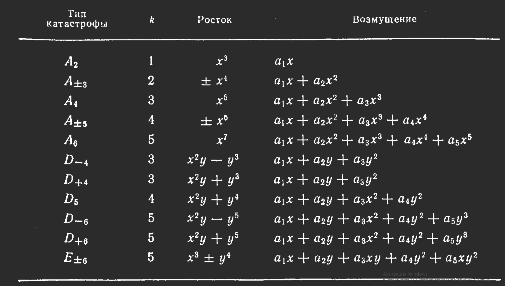

У нас есть автономная динамическая система с $k \leq 4$ параметрами ($c_\alpha$) заданная уравнением:
$\frac{d\phi_i}{dt} = -\frac{dV(\phi_j;c_\alpha)}{d\phi_i}$; V - потенциальная функция
Теория катстроф исследует стабильные положения: $\frac{dV(\phi_j;c_\alpha)}{d\phi_i}=0$ в зависимости от изменения параметров

Так как $x_i$ нас дальше неинтересуют, переобозначим $\phi_i$ как $x_i$
### Теорема о неявной функции
Если $F=-\nabla V \neq 0$, то можно произвести замену координат так, что сила($F$) будет иметь единственную не равную 0 координату, тогда $V=y_1+const$
### Лемма Морса
Если система в равновесии, то $\nabla V = 0$, тип устойчивости определяется собств. знач гессиана V $\frac{d^2 V_{ij}}{dx_i dx_j}$ 
Если $\det V \neq 0$, то $V$ может быть представлена в виде кв. формы $V=\sum \lambda_i y_i^2$,   $\lambda$ - собств. знач гессиана $V$.
Тогда делаем новую замену координат: $\bar{y_i}=\sqrt{|\lambda_i|}y_i$, $V = - \bar{y_1} - \bar{y_2}...+\bar{y_i} + ... + \bar{y_n} = M(\bar{y})$, ф-ция М - морсовское седло.
### Формы Тома
#### Лемма расщепления Тома
Если $\det V = 0$, то допустим что только $\lambda_1,... \lambda_l = 0$, тогда разложим на морсовскую и не морсовскую части:
$V = \sum\limits_{j=l+1}^n \lambda_j(c) y^2_j(x) + f_{NM}(y_1(x,c), ..., y_l(x,c), c)$
#### Теорема Тома
Гарантирует что существует замена т.ч. $V = CG(l) + \sum\limits_{j=l+1}^n \lambda_j y^2_j$ (каноническая форма), CG - росток катастрофы
$l$ - кол-во параметров в ростке
##### Каноническая форма
$V = Cat(l, k) + \sum\limits_{j=l+1}^n \lambda_j(c) y^2_j(x)$;  $Cat(l,k) = CG(l) + Pert(l,k)$

*Пример*: ф-ция $V(x;c)$ зависит от 10 переменных, и 3 параметров $c$. Точка $(x^0,c^0)$ - несорсовская крит. точка. Гессиан $V$ имеет 2 собств. знач = 0, 3 отрицательных и 5 положительнхы. 
Тогда $V=Cat(l,k) + f_M(y_3, ..., y_{10})$; $Cat(2,3) = D_{\pm 4} \implies$
$V = (y_1^2y_2\pm y_2^3) + (a_1y_1 + a_2y_2 + a_3y_2^2) + \sum\limits_{j=3}^{10} \lambda_j(c) y^2_j(x)$ 
### Предвестники катастроф
##### Модальность
У системы существует больше одного состояния - у потенциальной функции больше чем 1 локальный минимум
##### Недостижимость
Система находящаяся в состоянии равновесия которое является морсовским седлом - неустойчива. Если у потенциальной ф-ции больше чем один локальный минимум, то у неё обязательно есть хотя бы одно седло.
##### Критическое замедление/смягчение моды
##### Аномальная дисперсия
Наблюдаемая физ. система задана скорее распределением чем точкой в пр-ве параметров.
*Обычно* вероятностное распределение имеет вид $P(x,c) = Ne^{\frac{-V(x;c)}{D}}$, приведя к каноническому виду получим $P(x,c) = Ne^{\frac{\sum\lambda_i}{D}}$
И тогда ковариация $\langle\Delta x_i, \Delta x_j\rangle= \frac{1}{2}\delta_{ij}\frac{D}{\lambda_j}$. Так как D мало, то и дисперсия мала, если только $\lambda_i$ не окажется аномально низким (что и является признаком катастрофы). В реальном мире дисперсия ряда по мере приближения к катастрофе растёт.
